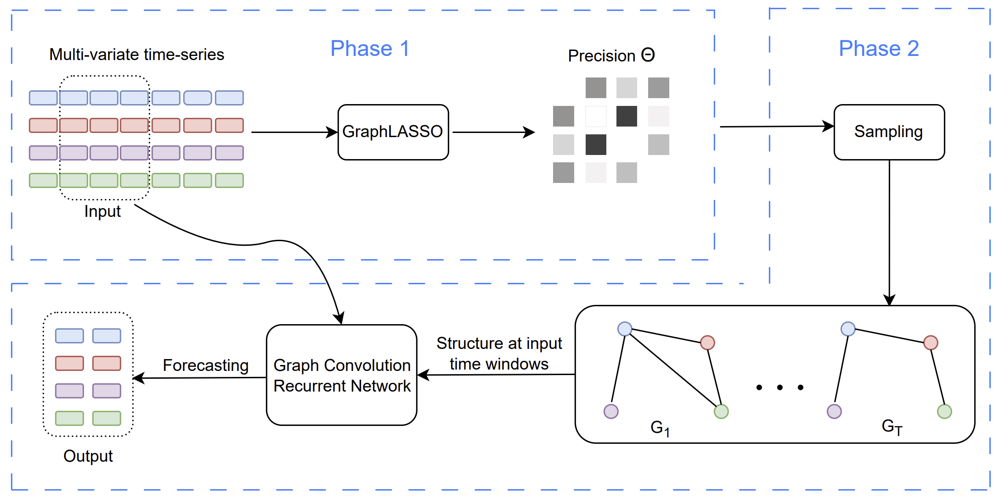

# Sparsity exploitation via discovering graphical models in multi-variate time-series forecasting

https://arxiv.org/pdf/2306.17090.pdf

Contributors:
* Ngoc-Dung Do
* Truong Son Hy (Correspondent / PI)
